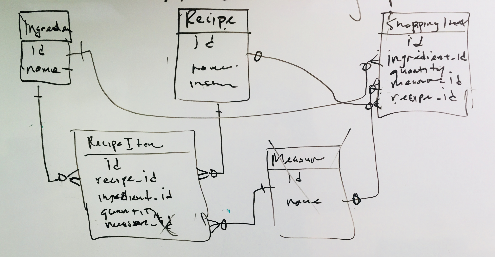

# Reciplee

An Android app with prebuilt recipe database, auto generated shopping list, recipe calendar planner, and more!

## Why Reciplee?

Wouldn't it be great to have so much done for you with a few taps on your smart-phone?  Well, I decided to build an app that could create a list of shopping ingredients from real recipes all at once.  It merges similar ingredients from different recipes and allows anyone to plan delicious recipes for the family.  There are other recipe apps out there, but this is the only one that can assemble a shopping list from selected recipes.  Some apps dump all ingredients into one list and then the user has to sort through them.  I made this so it can do the sorting for you, saving anyone time if all they want is to make recipes and go buy what they need, and not anything else.

### First Alpha Release

The app is in a first alpha release state, version 0.0.1.  

There are no known bugs when running on Android physical devices.  The features noted below run as expected.

On the Android Emulator, there are two bugs.  The first is that the first item in the nav drawer ("Shopping List") won't click.  This was tested against a "New Activity, Navigation Drawer Activity" built from default settings in Android Studio/IntelliJ and that default project, when built without any code changed, the first item in the nav drawer was also unclickable.  This can be assumed to be an issue with the set up of the emulator.

The second bug on Android Emulator is that on the first build, the auto text complete for recipe search does not activate.  The app must be completely closed and restarted, then it works as expected.

### Testing, Restrictions, and Versions

The minimum SDK version for the app is Android 21, which is [Android 5.0 Lollipop](https://developer.android.com/about/versions/android-5.0).

The app has been tested on:

- the Nexus 5x emulator in Android Studio/IntelliJ with Android API 27, 8.1.0
- the ZTE N9560 (Android 7.1.1, API 25)

There is a strict restriction on the orientation.  The app will always stay in portrait view.  Since so much happens in vertical layouts, there isn't really a need to have a horizontal view unless it was to build a better interface for a table sized device.  Since those features have been backlogged at this time, the app stays in portrait mode always.

Since the recipes were pulled in in one language, it didn't make since to add support for languages other than English.  While some of the titles are written in other languages, you will have to be able to read English to use this app.

The app is written in Java, with support parsers to process the data dump written in XSLT, Python, and JSON.

#### 3rd Party APIs

###### Data Dump Prep

- The recipes were pulled from [Statistics | Recipes Wiki | FANDOM powered by Wikia](http://recipes.wikia.com/wiki/Special:Statistics)
- Tools to parse the data dump were written by me in XSLT, Python, JSON, and [GSON](https://github.com/google/gson)

###### In the app

- [Recipe Puppy](http://www.recipepuppy.com/about/api/) may be configured with [Retrofit](http://square.github.io/retrofit/) and GSON to add support for generic recipes like pancakes, Denver omelets, spaghetti, and other regular recipes that may not be included in the FANDOM data. The FANDOM data includes a lot of obscure recipes and users may want functionality to add simple recipes in addition to eclectic ones.

#### Services

- [Google Calendar](https://developers.google.com/gsuite/guides/android) is to schedule recipes on the user’s calendar app.  However, it does not need permissions and does not implement a two way data exchange as it could if it implemented Calendar Provider.

### Cosmetic goals, sorted by most basic

- updating the Expandable Shopping List to a recycler adapter that could use CardViews
- making ingredient deletion or recipe deletion swipeable, particularly useful if the expandable list adapter had cardviews
- a clear logo (right now there is a little easter egg where the logo should be)

### Backlog stretch goals, sorted by utility/time

###### Custom recipes

A feature to add custom recipes.  Right now users can add custom ingredients, but they cannot build a full recipe that will display in the Meal Planner view.  This would be the most intuitive feature to add in that it would be something the user would implicitly expect to be able to do.  This is the most import thing to add.

###### Pulling classic and basic recipes

Finding the top 500 recipes searched for or made, like cheese pizza, green salad, or birthday cake, and building an anticipated recipe database would provide users with a better experience.  I don't think people will be impressed by Zambian Chicken Stew if they can't find cheeseburgers.  If the app was being used, it may be useful to set up RecipePuppy or another Recipe API and with each API call, automate the saving of that recipe, thus automating the completion of this goal simply by the app being used by people.

###### Search by ingredient and browse by category

The parser did save category information for each recipe and it currently exists in the database on the app.  Writing a simple query and building a new fragment to look at the categories would be a simple way to provide an additional level of engagement.

Searching by ingredient would be a nice feature.  If it was set up with AutoCompleteTextView and the goal above for getting ingredients with spaces was complete, a search for cheese could suggest "Jack cheese" or "cheddar cheese".  That would be fun and it would be cool to help users find what they were in the mood for.  This can already be done to an extent with the recipe search already implemented, though.

###### Improving the parser

The data dump included over 28,000 recipes.  However, due to inconsistent formatting, only about 4% of the recipes were parsed so the final app could have consistent features without bugs.  

For example, only recipes that had ingredients with an asterisk at the start of the ingredient line, contained at least one substring of the regex `\[\[[a-zA-Z\uFFFF]+\]\]` (meaning that the ingredient does not have a space like "Jalapeno Jack Cheese" or "white wine") were all thrown out.  If the directions did not start with a `#` on a line, the entire recipe was thrown out.

Improving the parser could exponentially increase the amount of recipes.  Just being able to get recipes with spaces in the ingredients and recipes with or without hashtags before the directions increase the recipe volume by tenfold or more.

###### Sharing the recipe and incorporating Calendar Provider, User accounts

A broadcast to other users with the app would allow families and roommates to coordinate meal planning together.  The Calendar API could be used to schedule who was cooking with who all from the app itself.  This would only be really useful if the core features that make the app useful (listed above) were implemented.

###### Location information, recipe suggestions, machine learning

Track user tastes and learn to suggest better recipes for users.  See if there are correlations between where users shop, their recipe preferences, and how preferences correlate to other users.  This would be pointless if there was not a heavy user base and the above goals were successfully implemented in a smooth and intuitive way.

## Links

###### Wireframes

- [first draft](docs/wireframe.pdf)
- [second draft](docs/wireframeDraft2.pdf)

###### ERD

- [first draft](docs/erd.pdf)

